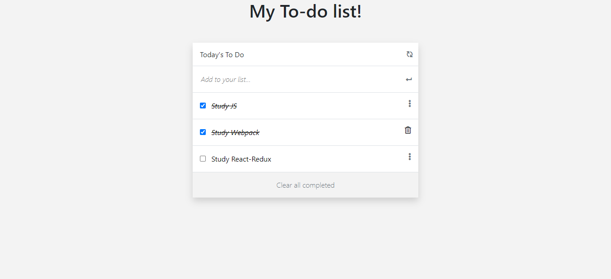

# To-Do-list

>"To-do list" is a tool that helps to organize your day. It simply lists the things that you need to do and allows you to mark them as complete.



## Built With

- HTML
- CSS
- JavaScript
- Webpack

## Live Demo

[Live Demo Link](https://petumazo.github.io/to-do-lists/)


## Getting Started

To get a local copy up and running follow these simple example steps.

### Setup

- clone: run ```https://github.com/petumazo/to-do-lists.git```.
- Move to cloned folder: run ```git cd TO-DO-LISTS```.

### Install

- Install the dependencies in the local node_modules folder: run ```npm intall```.
- Build your app: run ```npm run build```.
- Deploy local server: run ```npm start build```.

## Authors

👤 **David Alvarez Mazzo**

- GitHub: [@petumazo](https://github.com/petumazo)
- Twitter: [@petudeveloper](https://twitter.com/petudeveloper)
- LinkedIn: [David Alvarez Mazzo](https://www.linkedin.com/in/davidalvarezmazzo/)

## 🤝 Contributing

Contributions, issues, and feature requests are welcome!

Feel free to check the [issues page](../../issues/).

## Show your support

Give a ⭐️ if you like this project!

## Acknowledgments

- Hat tip to anyone whose code was used
- Inspiration
- etc

## 📝 License

This project is [MIT](./MIT.md) licensed.
